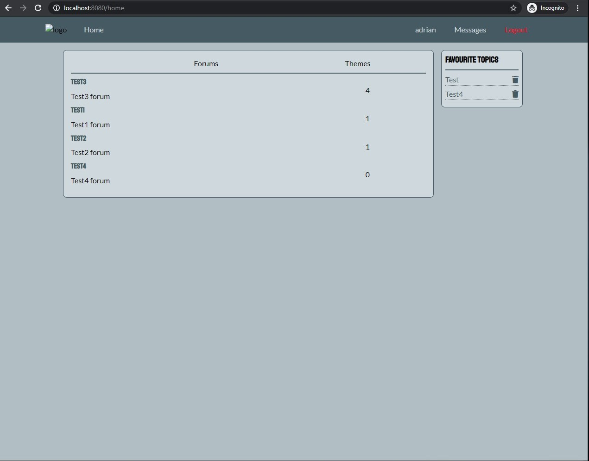
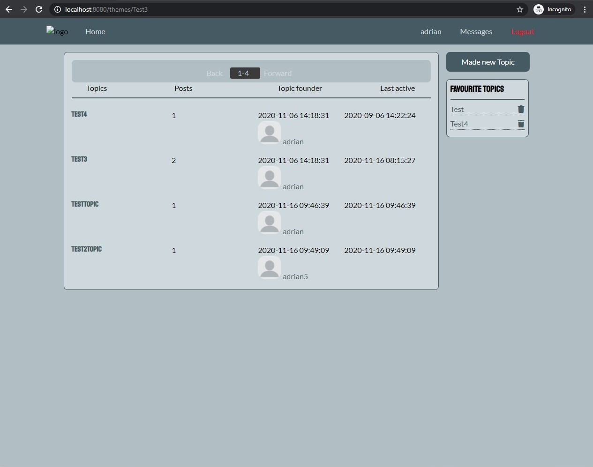
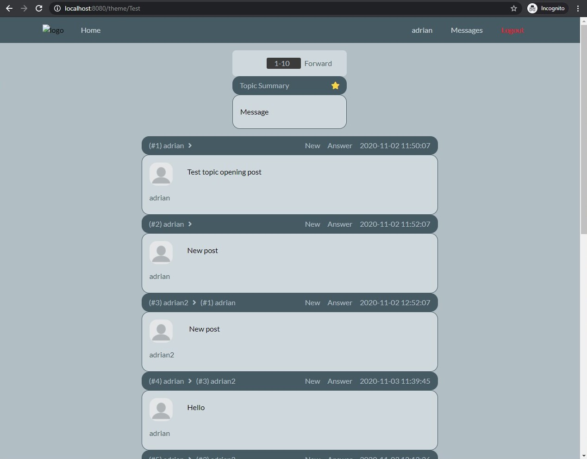
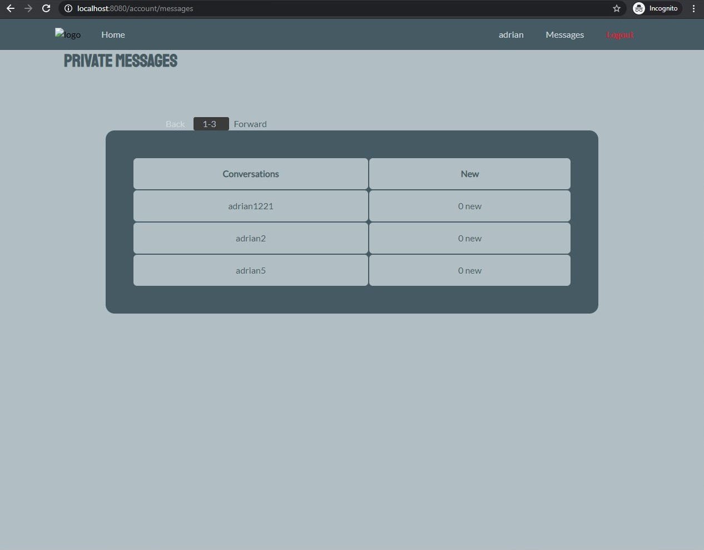
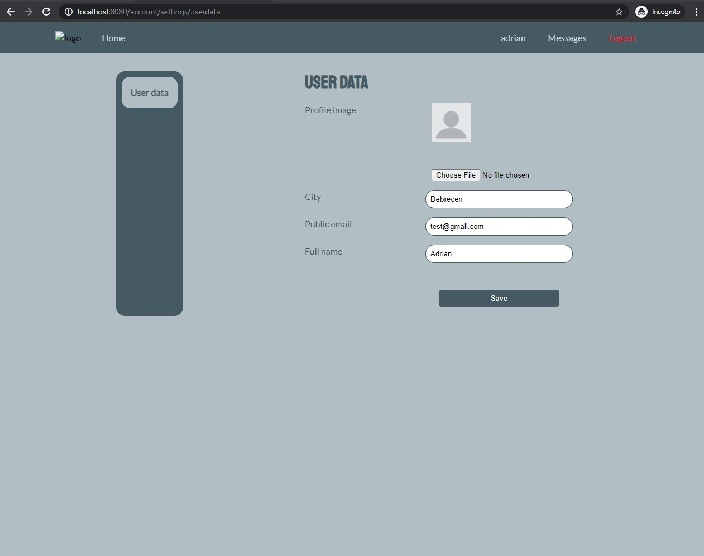
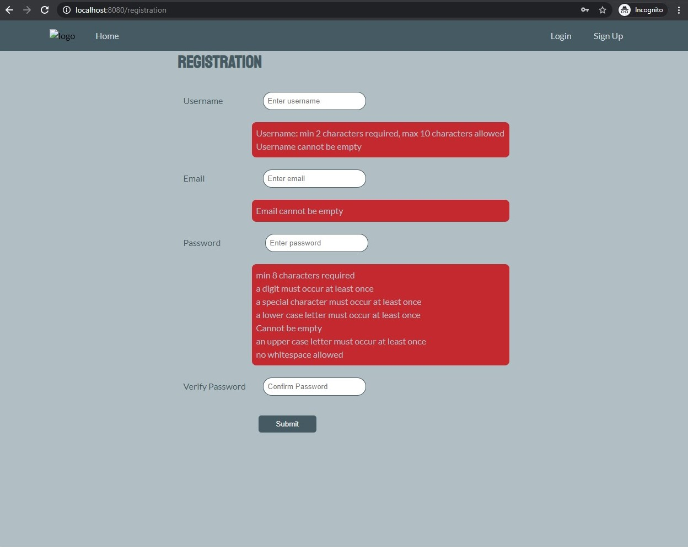

# SZFM_2020_10_ErrorByNight_BigProject

Forum webapp in Java Spring.

## Requirements

Building the project requires JDK 11 or later and [Apache Maven](https://maven.apache.org/).

## Commands in webapp folder

- mvn package
- java -jar -Dspring.profiles.active=prod ./target/webapp-1.0.jar

## In browser
- http://localhost:8080/

