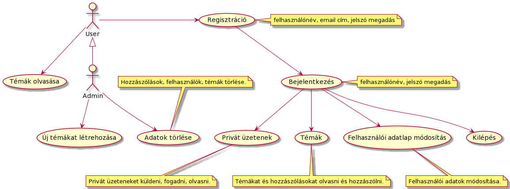
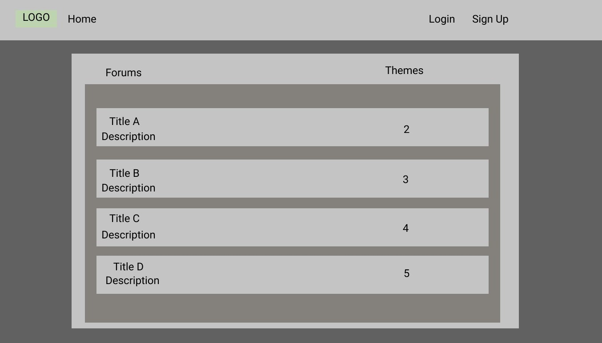
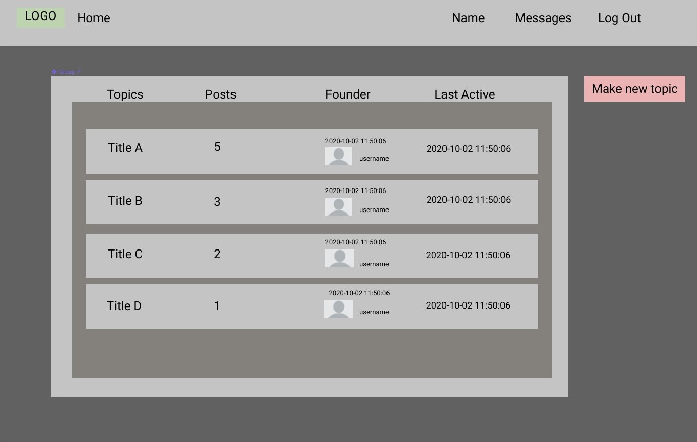
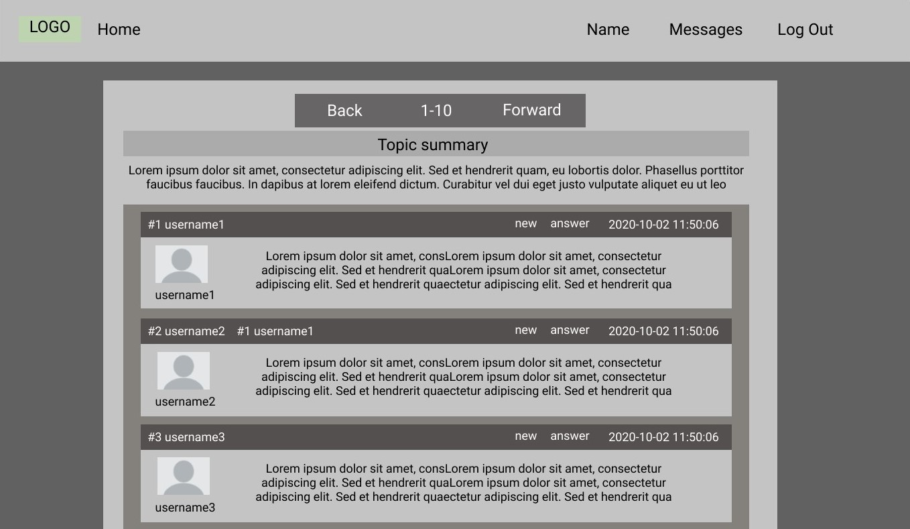
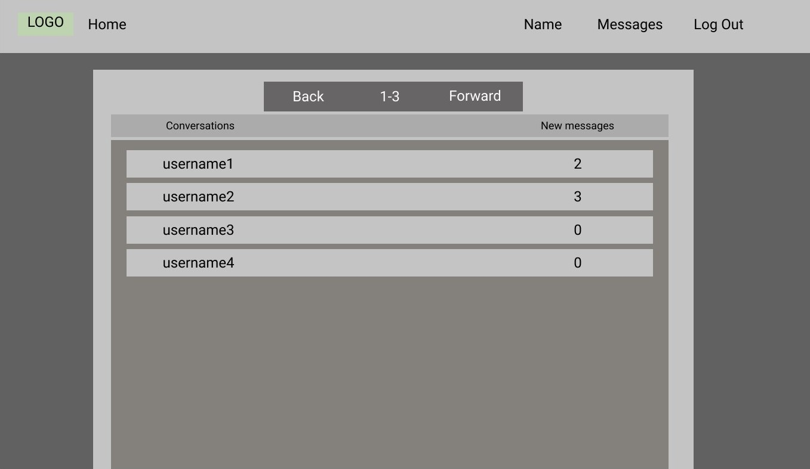
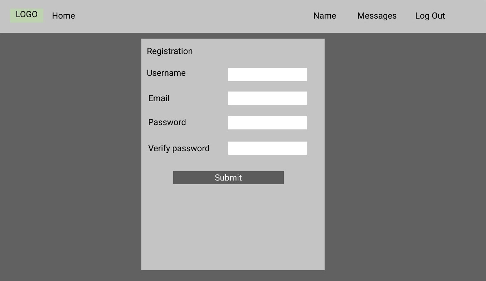

# 1. A rendszer céljai és nem céljai
-
# 2. Jelenlegi helyzet leírása
-
# 3. Vágyálom rendszer leírása
&nbsp;&nbsp;&nbsp;Ügyfelünk egy webáruház, amely egy fórummal szeretné bővíteni szolgáltatását, egy platformot biztosítani már meglévő vagy potenciális vásárlóinak a hatékonyabb kommunikáció érdekében.  
&nbsp;&nbsp;&nbsp;Vásárlási tapasztalatok, vélemények megosztása, továbbá a webáruházban található termékekkel
kapcsolatos kérdések megválaszolása a fő cél. A felhasználók számára lehetőség biztosítása egy közösség kialakulására, ezáltal
új témakörök indítása és a felhasználók egymás közötti privát üzenetek küldésének lehetősége is adott kell legyen.
Szükséges a fórumra történő bejelentkezés és regisztráció biztosítása. A regisztráció egyúttal a webáruházba történő belépést is biztosítja, ezáltal
ügyfelünk saját adatbázissal fog rendelkezni, a fejlesztés során tetszőleges adatbázis használható.  
&nbsp;&nbsp;&nbsp;A felhasználói felületnek letisztultnak és informatívnak kell lennie, továbbá mobil, tablet vagy asztali nézettel kell rendelkeznie.
A különböző webböngészők egyformán kell, hogy megjelenítsék a felületet. 
Az alkalmazás backend része java nyelven a Spring keretrendszerben kell elkészüljön. A frontend tetszőleges keretrendszert használhat.
Az adatbázis relációs kell legyen és a JPA keretrendszert kell használni.
Regisztráció esetén a megadott adatok helyességéről szerver oldalon gondoskodunk és alapos visszajelzést kell küldeni hibás adat megadásakor.
# 4. Jelenlegi üzleti folyamatok modellje
-
# 5. Igényelt üzleti folyamatok modellje
### 5.1 Regisztráció/Belépés  
Egyedi felhasználónév, létező és megfelelő email cím, megfelelő hosszúságú és elég erős jelszó megadása.
Felhasználó tájékoztatása a mem megfelelő adatok megadásáról. 
A jelszó megerősítése szükséges újra megadásával. Regisztráció megerősítő kód küldése a megadott email címre.
Belépés felhasználónév és jelszóval történik.

### 5.2 Felhasználókezelés  
- #### 5.2.1 Nem regisztrált felhasználó  
&nbsp;&nbsp;&nbsp;&nbsp;&nbsp;&nbsp;Olvashatja az oldalon a témákat és hozzászólásokat.  
- #### 5.2.2 Regisztrált felhasználó   
&nbsp;&nbsp;&nbsp;&nbsp;&nbsp;&nbsp;Belépés után olvashatja az oldalon a témákat és hozzászólásokat, továbbá új hozzászólásokat tud írni.  
&nbsp;&nbsp;&nbsp;&nbsp;&nbsp;&nbsp;Lehetősége van más felhasználóknak privát üzenetek küldésére és fogadására.  
-  #### 5.2.3 Céges dolgozó
&nbsp;&nbsp;&nbsp;&nbsp;&nbsp;&nbsp;Belépés után olvashatja az oldalon a témákat és hozzászólásokat, továbbá új hozzászólásokat tud írni.   
&nbsp;&nbsp;&nbsp;&nbsp;&nbsp;&nbsp;Lehetősége van más felhasználóknak privát üzenetek küldésére és fogadására.  
&nbsp;&nbsp;&nbsp;&nbsp;&nbsp;&nbsp;Nyithat új témákat, törölhet hozzászólásokat, témákat, felhasználókat.

### 5.3 Felhasználói adatok megjelenítése/kezelése  
Felhasználói adatlapon teljes név, publikus email cím, város, egyéni profilkép megadása és megváltoztatása.(Nem kötelező megadni.)
Jelszó megváltoztatása, új jelszó beállítása. Az adatlapon továbbá megjelenik a felhasználó regisztrálásának 
időpontja, utolsó belépési időpontja.

### 5.4  Privát üzenetek  
Egy másik felhasználó adatlapját megnyitva egy gombra kattintva privát üzenet küldése. 
Saját üzenetek időrendi sorrendbe listázva, megjelenítve az új üzenetek száma az adott felhasználóval.
# 6. Követelménylista
-
# 7. Használati esetek
  

# 8. Megfeleltetés, hogyan fedik le a használati esetek a követelményeket
A sorszámok a Követelmény specifikáció 4. bekezdésére hivatkoznak.

- #### 4.1 Regisztráció/Belépés
  - Felhasználónév, email cím, jelszó megadása regisztrációnál,
  - Felhasználónév, jelszó megadása belépésnél
- #### 4.2.1  Nem regisztrált felhasználó
  - Témák olvasása
- #### 4.2.2 Regisztrált felhasználó
  - Témák olvasása és hozzászólás írása.
- #### 4.2.3  Céges dolgozó
  - Admin jogosultság
  - Új témák létrehozása
  - Adatok törlése
- #### 4.3 Felhasználói adatok megjelenítése/kezelése
  - Felhasználói adatlap módosítás
- #### 4.4 Privát üzenetek
  - Privát üzetenet küldése, fogadása, olvasása
# 9. Képernyő tervek
A képernyő tervek a Figma webes szerkesztővel készültek.

### Főoldal:  
  

### Témák egy forum kategórián belül:  
  

### Egy téma hozzászólásai:  
  

### Csevegő partnerek listázása:  
  
 
### Regisztrációs űrlap:  
  

# 10. Forgatókönyvek
A felhasználó miután sikeresen elérte az oldalt, lehetősége van:

- ### Regisztrálni 
  - Egyedi felhasználónév, létező és megfelelő email cím, megfelelő hosszúságú és elég erős jelszó megadásával.
  - A megadott emailre küldött megerősítő kóddal aktiválni a regisztrációt.
- ### Belépni az oldara
   - Felhasználónév és jelszó megadásával.
- ### Belépés után 
    - Privát üzeteneket küldeni, fogadni, olvasni.
    - Témákat és hozzászólásokat olvasni és hozzászólni.
    - Új témákat létrehozni. (Csak céges dolgozóknak)
    - Felhasználói adatlapon teljes név, publikus email cím, város, egyéni profilkép megadása és megváltoztatása.
    - Jelszó megváltoztatása, új jelszó beállítása.
    - Kilépés az oldalról.
- ### Belépés előtt
   - Témákat és hozzászólásokat olvasni.
# 11. Funkció – követelmény megfeleltetés
-
