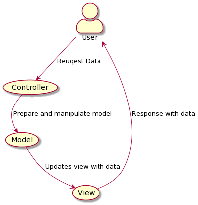
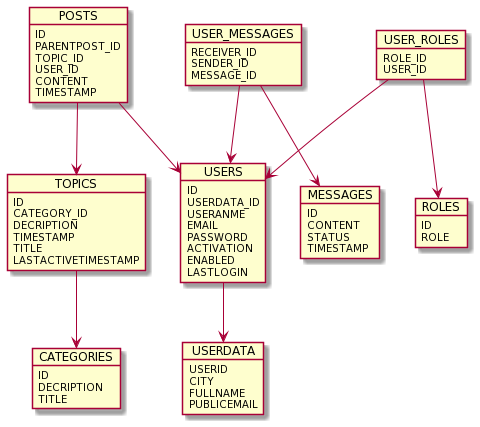

# 1. A rendszer céljai
- A felhasználók hozzá tudjanak szólni a meglévő témákhoz, nyilvános beszélgetést folytatva
- A céges dolgozók új témákat tudjanak nyitni, és legyen módjuk moderálni a meglévőket egy tiszteletteljes beszélgetés folytatásának megtartása érdekében
- Privát üzenet funkciójával olyan beszélgetést biztosítani amelyet csak a két résztvevő felhasználó láthat (ennek megvalósítása az adott felhasználó adatlapján, az erre megfelelő gomb használatával eszközölhető)
- A témákhoz való hozzászólások esetén minden hozzászólás azonosítható legyen egy felhasználóval.
- A nem regisztrált felhasználók korlátozása (a fórumon kizárólag bejegyzések olvasásának lehetősége)
- A felhasználó tájékoztatása nem megfelelő adatok megadásáról a regisztráció során
- Egyéni profilkép feltöltésének lehetősége a felhasználói adatlapra
- A felhasználói adatok biztonságos tárolása

# 2. A rendszer nem céljai

- Teljeskörű hozzáférés biztosítása nem regisztrált felhasználók számára
- Körlevelek küldésének lehetősége
- "Like/Dislike" alapú szavazási rendszer kialakítása a hozzászólások megbízhatóságának megszavazása érdekében
- Csoportos privát beszélgetések létrehozása
- Saját felhasználói fiók törlése céges felhasználó közreműködése nélkül
- A felhasználó hozzászólásainak utólagos módosítása
- Kötelezni a felhasználót további adatok (például : teljes név, e-mail cím) megadására
- Biztosítani nem adminisztrátori hatáskörrel rendelkező felhasználó számára az adattörlés lehetőségét

# 3. Projektterv

&nbsp;&nbsp;&nbsp;Egy már meglévő webshop szolgáltatásait bővítjük egy fórummal, ami egy olyan platformot biztosít a meglévő, illetve új vásárlók számára, ahol hatékonyan kommunikálhatnak. A projekten négy fő dolgozik, megosztva a munkát. Az alkalmazás frontend és a backend részén is 2-2 fő dolgozik.  
&nbsp;&nbsp;&nbsp;A projekttagok minden héten megbeszélik a heti feladatokat és a hét végén történik a közös kód átnézése, felmerült kérdések, problémák, igények megbeszélése.  
&nbsp;&nbsp;&nbsp;A projekt nagyobb részfeladatokra kerül bontásra. Minden nagyobb részfeladatra 1 hét áll rendelkezésre, egyszerre mindenki csak 1 kis feladatot vállalhat el. A cél hogy a hét végére minden kitűzött feladat elvégzésre kerüljön.
&nbsp;&nbsp;&nbsp;Az elkészült terveket a terveken nem dolgozó csapattársak közül átnézik, hogy megfelel-e a specifikációnak és az egyes diagramtípusok összhangban vannak-e egymással. A meglévő rendszerünk helyes működését a prototípusok bemutatása előtt a tesztelési dokumentumban leírtak végrehajtása alapján ellenőrizzük és összevetjük a specifikációval, hogy az elvárt eredményt kapjuk-e. További tesztelési lehetőségek: unit tesztek írása az egyes modulokhoz vagy a kód közös átnézése (code review) egy, a vizsgált modul programozásában nem résztvevő csapattaggal. Szoftverünk minőségét a végső leadás előtt javítani kell a rendszerünkre lefuttatott kódelemzés során kapott metrikaértékek és szabálysértések figyelembevételével. Az alábbi lehetőségek vannak a szoftver megfelelő minőségének biztosítására: * Specifikáció és tervek átnézése * Teszttervek végrehajtása * Unit tesztek írása * Kód átnézése.  
&nbsp;&nbsp;&nbsp;Nagyobb részfeladatok: Adatbázis létrehozása, Felhasználói felület létrehozása, Funkcionalitás implementálása, Tesztelés, Hibák javítása.  
A projekt leadási határideje 2020.12.07.

# 4. Üzleti folyamatok modellje

 A felhasználókat a fórumba lépve azonnal a már létrehozott témák fogják várni. Ezután a felhasználónak módjában áll: 
  * Témákat olvasni
  * Regisztrálni: felhasználónév, email cím és jelszó megadásával történik
  * Bejelentkezni: felhasználónév, jelszó megadásával
 
 Bejelentkezés után a felhasználó képes:
  * A megnyitott témákhoz hozzászólást írni
  * Privát üzeneteket küldeni és fogadni
  * Felhasználói adatok módosítására
  * Kilépésre
  
 Az admin képes a fórumon: 
  * Új témákat létrehozni
  * Adatok törlésére: hozzászólások, témák törlése

# 5. Követelmények

- Átlátható, letisztult dizájn
- A dizájn egyezzen a képernyőtervekkel
- Regisztrációs felület
- Felhasználói adatok védelmére vonatkozó irányelvek betartása
- A lehető legtöbb népszerű böngésző támogatása
- Belépés adminisztrátorként
- Lehetőség meglévő felhasználói adatok módosítására

# 6. Funkcionális terv
 [Funkcionális specifikációban](https://github.com/p-adrian05/SZFM_2020_10_ErrorByNight_BigProject/blob/main/functional_specification.md) megtalálható.
# 7. Fizikai környezet
A projekt elkészítéséhez IntelliJ IDEA szoftvert használunk.
- **Backend:** Java, Spring keretrendszer. Relációs adatbázis használata JPA keretrendszerrel.
- **Frontend:**
# 9. Architekturális terv
#### Architekturális tervezési minta

A rendszer tervezési mintája a MVC (Model-View-Controller) a Spring keretrendszerben.

#### Az alkalmazás rétegei, fő komponensei, ezek kapcsolatai

- A Model komponens az adatokat és a funkcionalitást csomagolja be, független a kimenet
  ábrázolásmódjától vagy az input viselkedésétől.
- A View komponensek jelenítik meg az információkat a felhasználónak.
- A Controller fogadja a bemenetet, melyet szolgáltatáskérésekké alakít a Model vagy a View felé.

#### Változások kezelése

- Egyszerűen kezelhető változások hajthatóak végre, mivel interfészektől vagy absztrakt osztályoktól történik az objektumok függése, nem konkrét implementációktól, ezáltal az implementációk anélkül változtathatóak, hogy hatással lennének más objektumokra.

#### Rendszer bővíthetősége

- A rendszer bővítésre nyitott.
#### Biztonsági funkciók
- Felhasználók jelszavai titkosítva kerülnek tárolásra az adatbázisban.
- Jogosultság nélkül az oldalon korlátozott funkciók érhetőek el.
- HTTPS protokoll használata.

# 10. Adatbázis terv

 [Adatmodellt legeneráló SQL szkript](./diagrams/db_script.txt)
# 11. Implementációs terv

# 12. Tesztterv
- Az alkalmazás backend részének tesztelése automatizálva lesz megoldva a JUnit 5 keretrendszer segítségével. A teszthez tesztelési jegyzőkönyv készül.   
- Frontenden a felhasználói felület manuálisan lesz tesztelve, a jegyzőkönyvben leírva a tesztelt funkció részletes leírása, az elvárt helyes működés, a kapott működés és az elfogadásról szóló döntési hozatal.
- Tesztelendő modulok:
    - Adatbázis modell és DAO osztályok.
    - Service osztályok.
    - Controller osztályok.
    - Felhasználó űrlapok helyes működése bejelentkezés, regisztráció és adatok megváltoztatás esetén, hibás adat megadása esetén elvárt működés.
    - Felhasználói felület, megjelenés.
# 13. Telepítési terv
A telepítést ügyfelünk végzi saját webszervereire és saját adatbázisukhoz kapcsolva.
# 14. Karbantartási terv
&nbsp;&nbsp;&nbsp;Az alkalmazáshoz jelenlegi és jövőbeli problémamentes használata érdekében folyamatos
frissítést biztosítunk az átadás utáni fél évben ingyenesen.   
&nbsp;&nbsp;&nbsp;Az új verziók két hetente kerülnek kiadásra, ide tartoznak az egyszerű hibák javítása, optimalizáció, új funkciók bevezetése vagy javítása felhasználói visszajelzések alapján. Kritikus, optimális működést befolyásoló hibák esetén azonnali, mielőbbi működőképes verzió kiadása történik.
