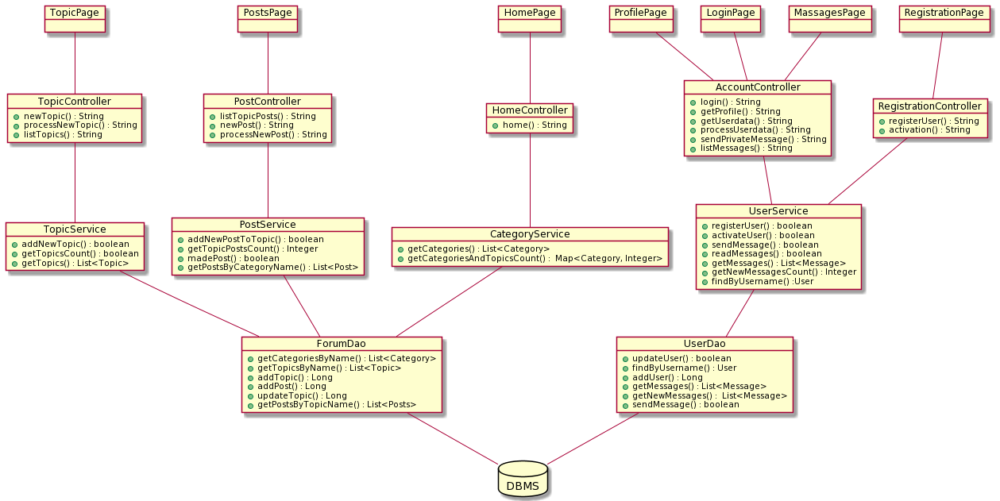

# 1. A rendszer céljai
-
# 2. A rendszer nem céljai
-
# 3. Projektterv

## Projekt bemutatása
  Egy már meglévő webshop szolgáltatásait bővítjük egy fórummal, ami egy olyan platformot biztosít a meglévő, illetve új vásárlók számára, ahol hatékonyan kommunikálhatnak.
  
## Költség- és erőforrás-szükségletek
  Az erőforrásigényünk kb. 10 személynap.
  A rendelkezésünkre álló 5 pont.
  
## Szervezeti felépítés és felelősségmegosztás
  A projekt megrendelője a webáruház tulajdonosa. A projektet  a projektcsapat fogja megtervezni, implementálni, végrehajtani.
  
## Rizikómenedzsment
  Az összeszedett és felkészült projektcsapat miatt, csupán a kialakult járványügyi helyzet lassíthatja a projekt befejezését.
  
## Csoportgyűlések
  A projekt hetente ülésezik, hogy megvitassák az azt megelőző hét problémáit, ill. megbeszéljék a következő hét feladatait. A megbeszélésről minden esetben MEMO készül, mely tartalmazza a következőket:
  * jelenlévők listája
  * megbeszélés helye, ideje
  * megbeszélt tevékenységek
  * felmerült kérdések, igények

## Minőségbiztosítás
  Az elkészült terveket a terveken nem dolgozó csapattársak közül átnézik, hogy megfelel-e a specifikációnak és az egyes diagramtípusok összhangban vannak-e egymással. A meglévő rendszerünk helyes működését a prototípusok bemutatása előtt a tesztelési dokumentumban leírtak végrehajtása alapján ellenőrizzük és összevetjük a specifikációval, hogy az elvárt eredményt kapjuk-e. További tesztelési lehetőségek: unit tesztek írása az egyes modulokhoz vagy a kód közös átnézése (code review) egy, a vizsgált modul programozásában nem résztvevő csapattaggal. Szoftverünk minőségét a végső leadás előtt javítani kell a rendszerünkre lefuttatott kódelemzés során kapott metrikaértékek és szabálysértések figyelembevételével.
  Az alábbi lehetőségek vannak a szoftver megfelelő minőségének biztosítására:
    * Specifikáció és tervek átnézése
    * Teszttervek végrehajtása
    * Unit tesztek írása
    * Kód átnézése
    
## Státuszjelentés
  Minden leadásnál a projektmenedzser jelentést tesz a projekt haladásáról, és ha szükséges változásokat indítványoz a projektterven. Ezen kívül a megrendelő felszólítására a menedzser 3 munkanapon belül köteles leadni a jelentést. A gyakorlatvezetővel folytatott csapatmegbeszéléseken a megadott sablon alapján emlékeztetőt készít a csapat, amit a következő megbeszélésen áttekintenek és felmérik az eredményeket és teendőket. Továbbá gazdálkodnak az erőforrásokkal és szükség esetén a megrendelővel egyeztetnek a projektterv módosításáról.

# 4. Üzleti folyamatok modellje
-
# 5. Követelmények
-
# 6. Funkcionális terv
-
# 7. Fizikai környezet
-
# 9. Architekturális terv
#### Architekturális tervezési minta

A rendszer tervezési mintája a MVC (Model-View-Controller) a Spring keretrendszerben.

#### Az alkalmazás rétegei, fő komponensei, ezek kapcsolatai

- A Model komponens az adatokat és a funkcionalitást csomagolja be, független a kimenet
  ábrázolásmódjától vagy az input viselkedésétől.
- A View komponensek jelenítik meg az információkat a felhasználónak.
- A Controller fogadja a bemenetet, melyet szolgáltatáskérésekké alakít a Model vagy a View felé.

#### Változások kezelése

- Egyszerűen kezelhető változások hajthatóak végre, mivel interfészektől vagy absztrakt osztályoktól történik az objektumok függése, nem konkrét implementációktól, ezáltal az implementációk anélkül változtathatóak, hogy hatással lennének más objektumokra.

#### Rendszer bővíthetősége

- A rendszer bővítésre nyitott.
#### Biztonsági funkciók
- Felhasználók jelszavai titkosítva kerülnek tárolásra az adatbázisban.
- Jogosultság nélkül az oldalon korlátozott funkciók érhetőek el.
- HTTPS protokoll használata.

# 10. Adatbázis terv

 [Adatmodellt legeneráló SQL szkript](./diagrams/db_script.txt)
# 11. Implementációs terv

# 12. Tesztterv
- Az alkalmazás backend részének tesztelése automatizálva lesz megoldva a JUnit 5 keretrendszer segítségével. A teszthez tesztelési jegyzőkönyv készül.   
- Frontenden a felhasználói felület manuálisan lesz tesztelve, a jegyzőkönyvben leírva a tesztelt funkció részletes leírása, az elvárt helyes működés, a kapott működés és az elfogadásról szóló döntési hozatal.
- Tesztelendő modulok:
    - Adatbázis modell és DAO osztályok.
    - Service osztályok.
    - Controller osztályok.
    - Felhasználó űrlapok helyes működése bejelentkezés, regisztráció és adatok megváltoztatás esetén, hibás adat megadása esetén elvárt működés.
    - Felhasználói felület, megjelenés.
# 13. Telepítési terv
-
# 14. Karbantartási terv
-
